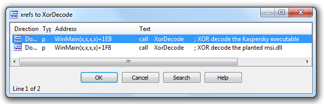
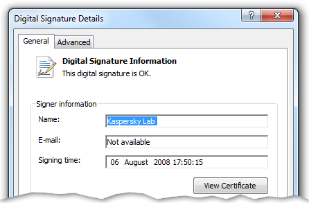
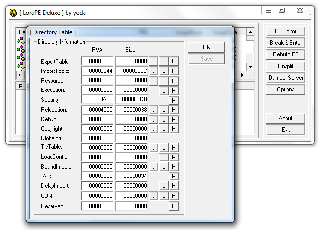
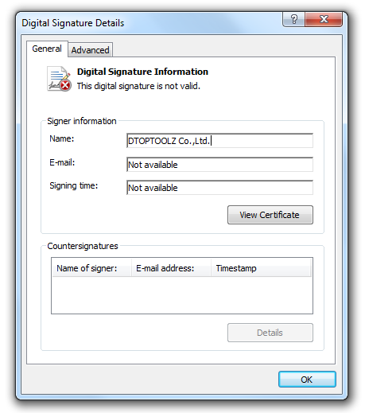

% Sakula DLL planting analysis
% David Cannings
% April 2016

\newpage
# Handling information

This document was produced by the NCC Group Cyber Defence Operations team. The content of this document should be considered proprietary information.  NCC Group has released this report publicly and gives permission to copy it at TLP WHITE. Please see the US CERT website for full details of the traffic light marking system.

# Introduction

This technical note discusses a version of Sakula uploaded to VirusTotal on the 25th April 2016.  The sample initially looked interesting as it uses a signed Kaspersky binary to load itself, presumably to avoid UAC.

Further research online shows that usage of this technique by Sakula has previously been documented.  A good detailed report is available [from SecureWorks](https://www.secureworks.com/research/sakula-malware-family) covering the evolution of Sakula and the usage of signed executables (both legitimate binaries and stolen code signing certificates).

In the sample analysed the main implant is never saved to disk as an executable, a common technique used by malware in the last few years.  The small size of this dropper and minimum amount of obfuscation make it an excellent sample to practise analysis.  Therefore this technical note discusses one method which can be used to extract the Sakula implant from memory. 

The overall aims are to:

* Extract the implant from memory after it has been decoded (enabling further analysis).
* Understand key sections of the overall chain of execution.

The following steps are discussed:

* Identifying a decoding routine and reimplementing it in Python.
* Using WinDbg to analyse code in a `DLLEntryPoint` function. 
* Dumping memory using WinDbg for further analysis.

The techniques used are valid for any program which conducts unpacks and executes itself in memory.

## Analysed sample

The sample analysed^[SHA256: `db8867508b131a2c66873a1c70a5cc82102576227a17aebdf42f72606d84b535`] was uploaded to VirusTotal on the 25th April 2016, no original filename information was available.  Almost identical binaries exist on VirusTotal from throughout 2014 and 2015, a list of similar samples is provided at the end of the document.

The file is not digitally signed and has no resources, therefore no icon.  It hit on a number of custom Sakula signatures which are provided in section \ref{yara_signatures}.  Specific detections by anti-virus products include Backdoor.Win32.Mivast.o (Kaspersky) and Trojan/Win32.Sakelua (AhnLab).  Microsoft link it to Trojan:Win32/Derusbi.A!dha.

A number of other files use the vulnerable Kaspersky installer in exactly the same way, including PlugX and Maudi.  See section \ref{similar_files} for more information.

## Thanks

Thanks to Cedric Halbronn for technical assistance and review during the creation of this document.

Thanks to Marc Ochsenmeier (@[ochsenmeier](https://twitter.com/ochsenmeier)) for clarifying why the Kaspersky executable attempts to load `msi.dll` twice.

Whilst writing this document the website [windbg.info](http://windbg.info/) was very useful.

\newpage
# Understanding the chain of execution

## Overview

A graphical overview of the steps taken by this malware is shown in figure \ref{dropper_graph}.  Items coloured green are saved to disk, items coloured blue only exist in memory.

This technical note is designed to be read in conjunction with the IDA databases, available separately. 

\newpage
# Dropper executable

The first executable is a dropper containing three other files which are saved to disk.  All functions are called directly from `WinMain()`, the overall steps are: 

* Opens itself for read access using `sub_401034`.
* Locates all three embedded files by looking for 8 byte markers using `sub_401000`. 
* Conducts a basic anti-sandbox check in `WinMain()`.
* Decodes two of the embedded files with XOR using `sub_4011CC`.
* Locates `%TEMP%` and saves three files: `s.exe`, `msi.dll` and `setup.msi`. 
* Executes `s.exe` in `WinMain()`.
* Deletes itself using a common trick with `ping` in `sub_401154`.

Now we know the data is embedded inside the executable it is necessary to identify the encoding mechanism. 

## Identifying the XOR encoding function

In a small executable it is possible to identify the XOR routine quickly by hand.  The conditions to look for are an XOR instruction in a loop where at least one of the operands is loaded from memory.

An automated alternative is to use the "interesting XOR"[^interesting_xor] IDA script from Jason Jones, which returns:

[^interesting_xor]: https://github.com/arbor-jjones/idataco/blob/master/idataco/widgets/interesting_xor.py

~~~~~~~~~~~~~~~~~~~~~~~~~~~~~~~~~~~~~~~~~~
Interesting in XorDecode XOR al 68h @ 0x4011E6
Interesting XOR in a loop XorDecode @ 4011E6: xor     al, 68h
~~~~~~~~~~~~~~~~~~~~~~~~~~~~~~~~~~~~~~~~~~

In this case it is exactly right, a manual review of the whole function is shown below.  This is XOR with a fixed key of 0x68 (the character `h`) but null bytes and bytes equal to the key are never encoded.

~~~~~~~~~~~~~~~~~~~~~~~~~~~~~~~~~~~~~~~~~~
.text:004011CC XorDecode       proc near               ; CODE XREF: WinMain(x,x,x,x)+1EB
.text:004011CC                                         ; WinMain(x,x,x,x)+1F8
.text:004011CC
.text:004011CC lpBuffer        = dword ptr  8
.text:004011CC dwLength        = dword ptr  0Ch
.text:004011CC
.text:004011CC    push    ebp
.text:004011CD    mov     ebp, esp        ; Standard function prologue
.text:004011CF    xor     edx, edx
.text:004011D1    cmp     [ebp+dwLength], edx ; Is the length 0?
.text:004011D4    jle     short end       ; Nothing to do, skip to end
.text:004011D6
.text:004011D6 loop:                                   ; CODE XREF: XorDecode+22
.text:004011D6    mov     eax, [ebp+lpBuffer]
.text:004011D9    lea     ecx, [edx+eax]  ; Get address of current byte
.text:004011DC    mov     al, [ecx]       ; Load current byte into AL
.text:004011DE    test    al, al          ; Is the current byte null (0x00)?
.text:004011E0    jz      short next
.text:004011E2    cmp     al, 68h         ; Does the current byte == the key (0x68)?
.text:004011E4    jz      short next
.text:004011E6    xor     al, 68h         ; XOR data byte with the key
.text:004011E8    mov     [ecx], al       ; Move the decoded byte back into the buffer
.text:004011EA
.text:004011EA next:                                   ; CODE XREF: XorDecode+14
.text:004011EA                                         ; XorDecode+18
.text:004011EA    inc     edx             ; Increment counter (i++)
.text:004011EB    cmp     edx, [ebp+dwLength] ; Compare counter and length
.text:004011EE    jl      short loop      ; Keep going until counter == length
.text:004011F0
.text:004011F0 end:                                    ; CODE XREF: XorDecode+8
.text:004011F0    pop     ebp             ; Standard function epilogue
.text:004011F1    retn
.text:004011F1
.text:004011F1 XorDecode       endp
~~~~~~~~~~~~~~~~~~~~~~~~~~~~~~~~~~~~~~~~~~

The assembly sequence shown above was the original detection mechanism for this binary.  It is used consistently throughout a number of Sakula executables (with different key bytes) and therefore makes a good signature.  Yara signatures are provided toward the end of this technical note in section \ref{yara_signatures}.

Calls to this function are shown below.  There are two in the dropper executable, manually commented during analysis:

Now that we understand the above routine we can find the data and decode it manually. 

## Extracting the files

It is possible to execute the dropper and retrieve the three embedded files from `%TEMP%`.  However to automate the process we need to understand where they are located in the file.

Near the start of `WinMain()` there is a call to `sub_401034` which opens the executable for read access using `GetModuleFileAameA()` and `CreateFileA()`.  The entire file is read into memory using `ReadFile()` and stored for later use.

This buffer is then used immediately, three calls are made to `sub_401000` which is named `FindDataInBuffer` below.

~~~~~~~~~~~~~~~~~~~~~~~~~~~~~~~~~~~~~~~~~~
.text:00401247    push    [esp+458h+dwFileLength]
.text:0040124B    mov     dl, 54h         ; dl is now 0x54 == 'T'
.text:0040124D    call    FindDataInBuffer
.text:00401252    push    [esp+45Ch+dwFileLength]
.text:00401256    add     dl, 0F8h        ; dl is now 0x4C == 'L'
.text:00401259    mov     esi, eax
.text:0040125B    call    FindDataInBuffer
.text:00401260    push    [esp+460h+dwFileLength]
.text:00401264    mov     dl, 45h         ; dl is now 0x45 == 'E'
.text:00401266    mov     ebx, eax
.text:00401268    call    FindDataInBuffer 
~~~~~~~~~~~~~~~~~~~~~~~~~~~~~~~~~~~~~~~~~~

This function looks for the same byte repeated 8 times consecutively in a buffer.  The function is annotated in the IDA database (available from Github), a rough equivalent in C is shown below:

~~~~~~~~~~~~~~~~~~~~~~~~~~~~~~~~~~~~~~~~~~ {.c}
LPBYTE FindDataInBuffer(LPBYTE buf, DWORD dwLength, char marker) {
	DWORD i = 0;
	DWORD j = 0;

	while (i < dwLength) {
		if (buf[i] == marker) {
			// Note the code starts with j equal to zero, but
            // would be more efficient if it was 1 :)
			j = 0;
			while (j < 8 && buf[i+j] == marker) {
				j++;
			}

			if (j == 8) return (LPBYTE)(buf+i);
		} 
	
		i++;
	}

	return 0;
}
~~~~~~~~~~~~~~~~~~~~~~~~~~~~~~~~~~~~~~~~~~

With the knowledge that a string like `TTTTTTTT` should be in the file it is possible to find it using a hex editor:

~~~~~~~~~~~~~~~~~~~~~~~~~~~~~~~~~~~~~~~~~~
00009880: 5454 5454 5454 5454 dd01 6ddb d9da 0b64  TTTTTTTT..m....d
00009890: 9860 a689 0000 e02a a9c8 0060 9b00 0000  .`.....*...`....
000098a0: 0b48 8cd8 6019 8a00 00b9 48c8 d2d1 d341  .H..`.....H....A
000098b0: 4a84 00dd 016d d903 c580 603e 8000 0089  J....m....`>....
000098c0: 4930 00a8 c800 a149 0140 d141 4a8c 00dd  I0.....I.@.AJ...
000098d0: 016d d903 c580 6012 8000 0089 4930 7390  .m....`.....I0s.
000098e0: c800 a149 0140 d141 4a8c 00dd 016d b948  ...I.@.AJ....m.H
~~~~~~~~~~~~~~~~~~~~~~~~~~~~~~~~~~~~~~~~~~

Immediately following the `TTTTTTTT` marker is the encoded file data, which can now be automatically extracted and decoded.

## Extracting & decoding the files

In most cases it should be possible to run the dropper in a virtual machine to safely extract the files.  Where this isn't desirable (or to automate mass extraction) a script can be written.  The required steps are:

* Identifies the correct XOR key byte, in case it changes.
* Scans the file for all markers (e.g. `TTTTTTTT`) and stores their location.
* Extracts each chunk of data and decodes with XOR.

A sample Python implementation of the decode routine could be:

~~~~~~~~~~~~~~~~~~~~~~~~~~~~~~~~~~~~~~~~~~ {.python}
def xor(data, key):
    """ Standard non-null, non-key XOR """

    out = ""

    for c in data:
        if ord(c) != 0 and c != key:
            c = chr(ord(c) ^ ord(key))

        out += c

    return out
~~~~~~~~~~~~~~~~~~~~~~~~~~~~~~~~~~~~~~~~~~

A full Python script that extracts the embedded files automatically is provided separately.

## Embedded files

The files contained in the dropper are summarised in the table below.

SHA256                                                             | Marker     | Name
-------------------------------------------------------------------|------------|------------
`83f40e70ea3ba0e614d08f1070dafe75092660003b8a1f8b563d4f5b012f4bae` | `EEEEEEEE` | `s.exe`
`2213038421a599c843ad7559cfaabb2a32488774acd5982c0bb4ab234580c8a8` | `LLLLLLLL` | `msi.dll`
`7f5e2f6d56fca11d4e6006e375027d4e6c72c5baf5cf10aa98f00e9368b98ddb` | `TTTTTTTT` | `setup.msi`

## Anti-sandbox checks

The executable attempts anti-sandbox techniques by checking that the mouse pointer has moved in both the X and the Y directions.  It does this by obtaining the location of the mouse pointer at the start of `WinMain()` using `GetCursorPos()` and storing the position in a local variable.

The code which obtains the first mouse position is shown below:

~~~~~~~~~~~~~~~~~~~~~~~~~~~~~~~~~~~~~~~~~~
.text:004011FE     and     [esp+44Ch+OriginalMouseLocation.x], 0 ; Set X position to 0

; Some unrelated instructions skipped

.text:0040120A     mov     esi, ds:GetCursorPos

; Some unrelated instructions skipped

.text:00401211     xor     eax, eax
.text:00401213     lea     edi, [esp+458h+OriginalMouseLocation.y]
.text:00401217     stosd                   ; Set Y position to 0
.text:00401217                             ;
.text:00401217                             ; stosd will store 0 from eax 
.text:00401217                             ; into memory location in edi
.text:00401218     jmp     short GetInitialCursorPos
.text:0040121A
.text:0040121A Wait:
.text:0040121A     push    1               ; dwMilliseconds
.text:0040121C     call    ds:Sleep
.text:00401222
.text:00401222 GetInitialCursorPos:
.text:00401222     lea     eax, [esp+458h+OriginalMouseLocation]
.text:00401226     push    eax             ; lpPoint
.text:00401227     call    esi ; GetCursorPos
.text:00401229     test    eax, eax
.text:0040122B     jz      short Wait
~~~~~~~~~~~~~~~~~~~~~~~~~~~~~~~~~~~~~~~~~~

Later in `WinMain()` the mouse location is obtained again.  The original and updated values are compared to ensure that both X and Y coordinates have changed, as seen below.

~~~~~~~~~~~~~~~~~~~~~~~~~~~~~~~~~~~~~~~~~~
.text:004013A6 WaitForMouseMove:                 ; CODE XREF: WinMain(x,x,x,x)+1E1
.text:004013A6     mov     esi, ds:GetCursorPos
.text:004013AC     jmp     short CheckMouseAgain
.text:004013AE
.text:004013AE Sleep:                            ; CODE XREF: WinMain(x,x,x,x)+1CD
.text:004013AE     push    1               ; dwMilliseconds
.text:004013B0     call    ds:Sleep
.text:004013B6
.text:004013B6 CheckMouseAgain:                  ; CODE XREF: WinMain(x,x,x,x)+1BA
.text:004013B6     lea     eax, [esp+458h+UpdatedMouseLocation] ; CheckMouseAgain
.text:004013BA     push    eax             ; lpPoint
.text:004013BB     call    esi ; GetCursorPos
.text:004013BD     test    eax, eax
.text:004013BF     jz      short Sleep
.text:004013C1
.text:004013C1 CheckPosX:                        ; Check the mouse has moved in the X
.text:004013C1                                   ; direction (left to right)
.text:004013C1     mov     eax, [esp+458h+UpdatedMouseLocation.x] 
.text:004013C5     cmp     eax, [esp+458h+OriginalMouseLocation.x]
.text:004013C9     jnz     short MouseHasMoved
.text:004013CB
.text:004013CB CheckPosY:                        ; Check the mouse has moved in the Y
.text:004013CB                                   ; direction (up and down)
.text:004013CB     mov     eax, [esp+458h+UpdatedMouseLocation.y] 
.text:004013CF     cmp     eax, [esp+458h+OriginalMouseLocation.y]
.text:004013D3     jz      short WaitForMouseMove
~~~~~~~~~~~~~~~~~~~~~~~~~~~~~~~~~~~~~~~~~~
 

## Self deletion

The final action taken is to delete itself from disk.  The dropper does this by:

* Calling `GetModuleFileNameA()` to retrieve the executable name.
* Running the `ping` utility to get a short delay, followed by `del`.
* Exiting the process immediately afterward (an executable cannot be deleted whilst running).

The final command looks like below, the command string is visible in the dropper (`%s` is replaced with the file name using `sprintf`).  

~~~~~~~~~~~~~~~~~~~~~~~~~~~~~~~~~~~~~~~~~~
cmd.exe /c ping 127.0.0.1 & del /q \"%s\"
~~~~~~~~~~~~~~~~~~~~~~~~~~~~~~~~~~~~~~~~~~

\newpage
# `s.exe` / `MediaSoft.exe` (Kaspersky installer)

## Overview

This program is named "Программа установки Антивируса Касперского 6.0 для Windows Workstations" or "Setup Kaspersky Anti-Virus 6.0 for Windows Workstations".  It is a genuine Kaspersky setup program and contains a valid code signature.

Load order vulnerabilities including DLL planting first received widespread publicity in 2010, information from code signing and the PE header indicate this binary was written in 2008.  There are a number of benefits to using a legitimate, signed application in this way.  The first is that UAC behaves differently for signed binaries, perhaps looking less suspicious to the user.  The second is that analysts are less likely to scrutinise a legitimate executable which has been signed by a reputable company.

## Vulnerable code

The DLL hijacking vulnerability is located in `sub_401460`, where `msi.dll` is dynamically loaded with `LoadLibraryA`:

~~~~~~~~~~~~~~~~~~~~~~~~~~~~~~~~~~~~~~~~~~
.text:0040146F    push    offset LibFileName ; "msi.dll"
.text:00401474    call    ds:LoadLibraryA
~~~~~~~~~~~~~~~~~~~~~~~~~~~~~~~~~~~~~~~~~~

Microsoft provide information on the [DLL search order](https://msdn.microsoft.com/en-us/library/windows/desktop/ms682586(v=vs.85).aspx) process used by Windows.  The file `msi.dll` is not on the list of known DLLs[^KnownDLLs] therefore the copy in `%WINDIR%\system32` is not automatically used.

[^KnownDLLs]: `HKLM\SYSTEM\CurrentControlSet\Control\Session Manager\KnownDLLs`

Because of this vulnerability the Kaspersky installer will load the planted `msi.dll` from the same directory, running code provided by the attacker.  The call to `LoadLibraryA` above is sufficient to trigger the Sakula code, execution will never return to the Kaspersky binary from `msi.dll`.

## Authenticode signature

Signature details are verified by Windows as shown below.

\newpage
# `msi.dll` (planted DLL)

Analysis in IDA Pro shows that `msi.dll` only has two functions.  The first is the `DllEntryPoint()` which contains nearly all code.  The second is identical in operation to the XOR decode function from the dropper but the key byte is provided as an argument instead of being hard coded.

Static analysis shows that `msi.dll` takes the following steps to load shellcode from `setup.msi`:

* Obtains the full path to `msi.dll` using `GetModuleFileNameA`
* Searches from the end of the string backward for the first `\` character (to get the directory).
* Appends `setup.msi` as seen above.
* Loads this file into memory and XOR decodes it.
* Calls the loaded code in memory.

## String obfuscation

`msi.dll` contains some minor string obfuscation to build the filename `setup.msi`, shown below.  No other anti-disassembly or security product evasion is evident.

~~~~~~~~~~~~~~~~~~~~~~~~~~~~~~~~~~~~~~~~~~
code:100010D      push    'i'
code:100010D3     push    'sm.p'
code:100010D8     push    'utes'          ; String stacking
code:100010DD     push    esp             ; Source
code:100010DE     push    ds:lpFileName   ; Dest
code:100010E4     call    strcat
~~~~~~~~~~~~~~~~~~~~~~~~~~~~~~~~~~~~~~~~~~

## Decode and call to shellcode \label{shellcode_call}

Much of `msi.dll` is standard API calls to locate `setup.msi` and read it into memory.  The final steps can be seen below, decoding the buffer and calling `eax`:

~~~~~~~~~~~~~~~~~~~~~~~~~~~~~~~~~~~~~~~~~~
code:1000115C     push    88h            ; XOR key byte
code:10001161     push    [ebp+dwSize]   ; Size of setup.msi
code:10001164     push    [ebp+lpBuffer] ; Address of buffer
code:10001167     call    XorDecode
code:1000116C     mov     eax, [ebp+lpBuffer]
code:1000116F     call    eax            ; Call decoded shellcode
~~~~~~~~~~~~~~~~~~~~~~~~~~~~~~~~~~~~~~~~~~

Therefore to analyse this code further we must stop debugging before the call at address `1000116F`. 

## Breaking on load

The first challenge is breaking into the `DllEntryPoint()` code in `msi.dll` before it runs.  The Kaspersky binary uses `LoadLibrary` but the load of the DLL is done entirely by Windows.  Stepping over the `LoadLibrary` call means that code in the `DllEntryPoint` function will be run automatically.  Single stepping through all of `LoadLibrary` is tedious and time consuming.

### Using WinDbg  \label{using_windbg}

The easiest mechanism is to set an exception any time a module named `msi` is loaded using the WinDbg command `sxe`.  This command is explained on [Riham Selim's blog](https://blogs.msdn.microsoft.com/rihamselim/2012/03/14/breaking-on-module-load/) at MSDN.  Filters added in this way can be viewed or modified using the menu option `Debug` > `Event Filters...`.

~~~~~~~~~~~~~~~~~~~~~~~~~~~~~~~~~~~~~~~~~~
# Break when msi.dll is loaded
0:000> sxe ld msi

# Continue debugging
0:000> g
ModLoad: 7d1e0000 7d49c000   C:\WINDOWS\system32\msi.dll
eax=00000000 ebx=00000000 ecx=008f0000 edx=7c90e514 esi=00000000 edi=00000000
eip=7c90e514 esp=0012ef94 ebp=0012f088 iopl=0         nv up ei ng nz ac pe nc
cs=001b  ss=0023  ds=0023  es=0023  fs=003b  gs=0000             efl=00000296
ntdll!KiFastSystemCallRet:
7c90e514 c3              ret

# Continue debugging
0:000> g
ModLoad: 10000000 10005000   C:\Documents and Settings\User\Desktop\Sakula\msi.dll
eax=0012fb68 ebx=00000000 ecx=6569736d edx=00000000 esi=00000000 edi=00000000
eip=7c90e514 esp=0012eba0 ebp=0012ec94 iopl=0         nv up ei ng nz ac pe nc
cs=001b  ss=0023  ds=0023  es=0023  fs=003b  gs=0000             efl=00000296
ntdll!KiFastSystemCallRet:
7c90e514 c3              ret
~~~~~~~~~~~~~~~~~~~~~~~~~~~~~~~~~~~~~~~~~~

There is an initial break for `C:\WINDOWS\system32\msi.dll` but the load fails (`eax` is null, no valid handle is returned).  This occurs because of the code in `sub_402510` in the Kaspersky installer that loads `msi.dll` and obtains the version number using `DllGetVersion` (note: this first call is safe because `msi.dll` is appended to the result of `GetSystemDirectoryA`).

The second exception is for the planted malicious DLL and `LoadLibrary` returns a handle address of `0012fb68` in `eax`.  In this case the load is unsafe because there is no explicit path, therefore the planted version from the application directory is used.

### Verifying the module has loaded

`msi.dll` has now been loaded into memory by Windows, this can be verified using `lm` to list modules:

~~~~~~~~~~~~~~~~~~~~~~~~~~~~~~~~~~~~~~~~~~
0:000> lm
start    end        module name
00400000 0040b000   setup      (deferred)             
10000000 10005000   msi        (no symbols)         
.. other modules omitted ..
~~~~~~~~~~~~~~~~~~~~~~~~~~~~~~~~~~~~~~~~~~

Therefore `msi.dll` has been loaded at its preferred base address of `0x10000000` and functions will have the same addresses shown in IDA, making debugging easier.  IDA suggests that `DllEntryPoint()` is located at 10001031, this can be verified in WinDbg using the display headers extension `!dh`: 

~~~~~~~~~~~~~~~~~~~~~~~~~~~~~~~~~~~~~~~~~~
0:000> !dh msi

File Type: DLL
FILE HEADER VALUES
     14C machine (i386)
       4 number of sections
53BD80C2 time date stamp Wed Jul 09 19:49:54 2014

       0 file pointer to symbol table
       0 number of symbols
      E0 size of optional header
    210E characteristics
            Executable
            Line numbers stripped
            Symbols stripped
            32 bit word machine
            DLL

OPTIONAL HEADER VALUES
     10B magic #
    0.40 linker version
     200 size of code
     600 size of initialized data
       0 size of uninitialized data
    1031 address of entry point
    1000 base of code
         ----- new -----
10000000 image base

.. other headers omitted ..
~~~~~~~~~~~~~~~~~~~~~~~~~~~~~~~~~~~~~~~~~~

This shows image base of `0x10000000` and address of entry point `0x1031`.  Therefore disassembling code at `0x10001031` should reveal the same code shown in IDA at the entry point:

~~~~~~~~~~~~~~~~~~~~~~~~~~~~~~~~~~~~~~~~~~
0:000> u msi+1031
msi+0x1031:
10001031 89ff            mov     edi,edi
10001033 55              push    ebp
10001034 89e5            mov     ebp,esp
10001036 83ec4c          sub     esp,4Ch
10001039 31c0            xor     eax,eax
1000103b 8b450c          mov     eax,dword ptr [ebp+0Ch]
1000103e 83f001          xor     eax,1
10001041 83f800          cmp     eax,0
~~~~~~~~~~~~~~~~~~~~~~~~~~~~~~~~~~~~~~~~~~

Correlating this code with IDA shows what we expect - the planted `msi.dll` has been loaded and is ready to run.  We can now break anywhere we choose in the `msi` module. 

### Examining how `DllEntryPoint()` is called

With `msi` loaded we can inspect the sequence of calls from `LoadLibrary` in the Kaspersky executable through to `DllEntryPoint` in `msi` by displaying a stack backtrace with `k`:

~~~~~~~~~~~~~~~~~~~~~~~~~~~~~~~~~~~~~~~~~~
0:000> k
ChildEBP RetAddr
0012eba0 7c91c4fa msi+0x1031
0012eca8 7c916371 ntdll!LdrpRunInitializeRoutines+0x344
0012ef54 7c9164d3 ntdll!LdrpLoadDll+0x3e5
0012f1fc 7c801bbd ntdll!LdrLoadDll+0x230
0012f264 7c801d72 kernel32!LoadLibraryExW+0x18e
0012f278 7c801da8 kernel32!LoadLibraryExA+0x1f
0012f294 0040147a kernel32!LoadLibraryA+0x94
0012f7c4 004036f5 setup+0x147a
0012ffc0 7c817077 setup+0x36f5
0012fff0 00000000 kernel32!BaseProcessStart+0x23
~~~~~~~~~~~~~~~~~~~~~~~~~~~~~~~~~~~~~~~~~~

The calls lead to `LdrpRunInitializeRoutines`, an internal Windows routine responsible for calling the entry point of executables or DLLs.  More information is available in [Matt Pietrek's article](https://www.microsoft.com/msj/0999/hood/hood0999.aspx) from the Microsoft Windows Journal.

This illustrates why execution never returns to the Kaspersky executable and why stopping in the `DllEntryPoint` is not as simple as setting a normal breakpoint.

## Decoding `setup.msi`

In the `msi` module the file `setup.msi` is loaded from disk and decoded using XOR (key byte `0x88`), as shown in section \ref{shellcode_call}.  Therefore we could decode `setup.msi` manually, but practise to analyse advanced encoding techniques is valuable.  

The steps described below work whether simple string obfuscation or more complex encryption is used, as long as the right functions and memory regions can be identified.

### Breaking before decode

The first step is to break immediately before the XOR decode function call, located at `0x10001167`: 

~~~~~~~~~~~~~~~~~~~~~~~~~~~~~~~~~~~~~~~~~~
0:000> bp msi+1167
0:000> g
Breakpoint 0 hit

eax=00000001 ebx=10001031 ecx=0012ead0 edx=7c90e514 esi=0012eb94 edi=00000001
eip=10001167 esp=0012eadc ebp=0012eb30 iopl=0         nv up ei pl nz na po nc
cs=001b  ss=0023  ds=0023  es=0023  fs=003b  gs=0000             efl=00000202
msi+0x1167:
10001167 e894feffff      call    msi+0x1000 (10001000)  ; Call XOR decode

0:000> ub
msi+0x115c:
1000115c 6888000000      push    88h                    ; Key byte
10001161 ff75f4          push    dword ptr [ebp-0Ch]    ; Length
10001164 ff75f8          push    dword ptr [ebp-8]      ; Buffer to decode
10001167 e894feffff      call    msi+0x1000 (10001000)  ; We are here
1000116c 8b45f8          mov     eax,dword ptr [ebp-8]
1000116f ffd0            call    eax
10001171 6aff            push    0FFFFFFFFh
10001173 e8c41e0000      call    msi+0x303c (1000303c)
~~~~~~~~~~~~~~~~~~~~~~~~~~~~~~~~~~~~~~~~~~

By this point the file data is already in memory.  A local variable holds a pointer to the data buffer, IDA names it `ebp+lpBuffer`.  The value is located on the stack at `ebp-8`, seen pushed to the stack in the disassembly above.

This address can be inspected using the display pointer command (this adapts to 32-bit or 64-bit automatically):

~~~~~~~~~~~~~~~~~~~~~~~~~~~~~~~~~~~~~~~~~~
0:000> dp ebp-8 L1
0012eb28  00380000
~~~~~~~~~~~~~~~~~~~~~~~~~~~~~~~~~~~~~~~~~~

### Inspecting shellcode memory permissions

The data to be decoded is therefore located at `0x380000`, a memory region previously returned by `VirtualAlloc`.  Permissions on the page can be confirmed with `!address`, showing it has read/write/execute permissions:

~~~~~~~~~~~~~~~~~~~~~~~~~~~~~~~~~~~~~~~~~~
0:000> !address 380000
Usage:                  <unclassified>
Allocation Base:        00380000
Base Address:           00380000
End Address:            00388000
Region Size:            00008000
Type:                   00020000	MEM_PRIVATE
State:                  00001000	MEM_COMMIT
Protect:                00000040	PAGE_EXECUTE_READWRITE
~~~~~~~~~~~~~~~~~~~~~~~~~~~~~~~~~~~~~~~~~~

### Examining memory - before decode

The contents of the memory region can now be examined.  Rather than using the address directly it is easier to dereference the pointer using `poi(..)` in case memory locations change between runs.  

~~~~~~~~~~~~~~~~~~~~~~~~~~~~~~~~~~~~~~~~~~
0:000> db poi(ebp-8)
00380000  dd 01 6d db d9 da 0b 64-98 60 a6 89 00 00 e0 2a  ..m....d.`.....*
00380010  a9 c8 00 60 9b 00 00 00-0b 48 8c d8 60 19 8a 00  ...`.....H..`...
00380020  00 b9 48 c8 d2 d1 d3 41-4a 84 00 dd 01 6d d9 03  ..H....AJ....m..
00380030  c5 80 60 3e 80 00 00 89-49 30 00 a8 c8 00 a1 49  ..`>....I0.....I
00380040  01 40 d1 41 4a 8c 00 dd-01 6d d9 03 c5 80 60 12  .@.AJ....m....`.
00380050  80 00 00 89 49 30 73 90-c8 00 a1 49 01 40 d1 41  ....I0s....I.@.A
00380060  4a 8c 00 dd 01 6d b9 48-ec 29 b8 00 00 00 03 c8  J....m.H.)......
00380070  84 03 c8 9c 03 00 03 00-03 c8 98 01 6d d5 4b dd  ............m.K.
~~~~~~~~~~~~~~~~~~~~~~~~~~~~~~~~~~~~~~~~~~

This memory region matches the start of `setup.msi` exactly, confirming it is the right data.  

### Examining memory - after decode

We can now step one time (over the function call, not into it) and then examine the memory again.

~~~~~~~~~~~~~~~~~~~~~~~~~~~~~~~~~~~~~~~~~~
0:000> p
.. WinDbg steps over the XOR decode routine ..

0:000> db poi(ebp-8)
00380000  55 89 e5 53 51 52 83 ec-10 e8 2e 01 00 00 68 a2  U..SQR........h.
00380010  21 40 00 e8 13 00 00 00-83 c0 04 50 e8 91 02 00  !@.........P....
00380020  00 31 c0 40 5a 59 5b c9-c2 0c 00 55 89 e5 51 8b  .1.@ZY[....U..Q.
00380030  4d 08 e8 b6 08 00 00 01-c1 b8 00 20 40 00 29 c1  M.......... @.).
00380040  89 c8 59 c9 c2 04 00 55-89 e5 51 8b 4d 08 e8 9a  ..Y....U..Q.M...
00380050  08 00 00 01 c1 b8 fb 18-40 00 29 c1 89 c8 59 c9  ........@.)...Y.
00380060  c2 04 00 55 89 e5 31 c0-64 a1 30 00 00 00 8b 40  ...U..1.d.0....@
00380070  0c 8b 40 14 8b 00 8b 00-8b 40 10 89 e5 5d c3 55  ..@......@...].U
~~~~~~~~~~~~~~~~~~~~~~~~~~~~~~~~~~~~~~~~~~

This shows how the data has changed.  The next instruction calls address `0x380000`, therefore we expect it to be valid code.  This can be confirmed by disassembling it and checking the results look sane: 

~~~~~~~~~~~~~~~~~~~~~~~~~~~~~~~~~~~~~~~~~~
0:000> u poi(ebp-8)
00380000 55              push    ebp
00380001 89e5            mov     ebp,esp
00380003 53              push    ebx
00380004 51              push    ecx
00380005 52              push    edx
00380006 83ec10          sub     esp,10h
00380009 e82e010000      call    0038013c
~~~~~~~~~~~~~~~~~~~~~~~~~~~~~~~~~~~~~~~~~~

This is valid code and appears to be a standard [function prologue](http://stackoverflow.com/questions/14765406/function-prologue-and-epilogue-in-c).

### Dumping shellcode memory region

The next step is to understand what this shellcode does.  Dumping it from WinDbg for further analysis in IDA is possible using the `.writemem` command: 

~~~~~~~~~~~~~~~~~~~~~~~~~~~~~~~~~~~~~~~~~~
0:000> .writemem "C:\\Out\\setup-msi-decoded.dat" poi(ebp-8)
Writing 10000 bytes................
Unable to read memory at 00388000, file is incomplete
~~~~~~~~~~~~~~~~~~~~~~~~~~~~~~~~~~~~~~~~~~

The warning given by WinDbg does not affect our analysis because we want the entire memory region.  An end address can be supplied if desired but WinDbg will simply stop when an invalid location in memory is accessed. 

The output file can now be loaded into IDA.

\newpage
# `setup.msi` (injected shellcode & implant)

## Overview

A few things are immediately visible in the decoded `setup.msi` file:

* The code appears to have been compiled from C rather than hand written (based on the quantity of code, standard function prologue / epilogues and the calling conventions used).
* Some uninitialised data is at offset `0x8FF`, preceded by `AAAA`.
* A list of API function names is at offset `0x983`, preceded by `BBBB`.
* There appears to be an embedded executable at offset `0xAA1`, preceded by `CCCC`.
* A custom PE loader is included to launch the embedded executable (strings 'MZ' and 'PE' around offset `0x2B9` provide a small clue here). 

Static analysis in IDA indicates the injected shellcode takes the following steps:

* Finds `kernel32.dll` in memory.
* Finds a number of 'essential' functions like `VirtualProtect` and `LoadLibrary`.
* Resolves the list of imports from offset `0x983`.
* Loads the embedded executable, including parsing relocations and processing the import table.
* Calls `eax` at offset `0x3D1` to run the entry point of the embedded executable.

## Locating `kernel32`

The standard code below is used to find `kernel32` from the process environment block (PEB): 

~~~~~~~~~~~~~~~~~~~~~~~~~~~~~~~~~~~~~~~~~~
0:000> uf 380063
00380063    push    ebp
00380064    mov     ebp,esp
00380066    xor     eax,eax
00380068    mov     eax,dword ptr fs:[00000030h] ; Get the PEB
0038006e    mov     eax,dword ptr [eax+0Ch]      ; Get PEB_LDR_DATA
00380071    mov     eax,dword ptr [eax+14h]      ; In memory order module list
00380074    mov     eax,dword ptr [eax]          ; Skip one module (using flink)
00380076    mov     eax,dword ptr [eax]          ; Skip another module
00380078    mov     eax,dword ptr [eax+10h]      ; eax is now kernel32
0038007b    mov     ebp,esp
0038007d    pop     ebp
0038007e    ret
~~~~~~~~~~~~~~~~~~~~~~~~~~~~~~~~~~~~~~~~~~

Note the usage of this technique means the code (which is 32-bit) will not work correctly on 64-bit versions of Windows, where the standard module load order is different under WoW64.

## Position independence trick

The following function appears right at the end of the shellcode to enable resolution of the variables in memory.  These would normally be located in an executable's `data` section but this doesn't exist for the loaded shellcode.

Therefore all variables are offset from the end of the shellcode.  The following function finds the location of the end of the shellcode by creating a dummy stack frame, saving the return address and adding 6 to skip over the remaining instructions.

~~~~~~~~~~~~~~~~~~~~~~~~~~~~~~~~~~~~~~~~~~
seg000:000008ED  FindEndOfShellcode    proc near
seg000:000008ED    push    ebp
seg000:000008EE    mov     ebp, esp
seg000:000008F0    call    $+5      ; Dummy call to save eip on stack
seg000:000008F5    pop     eax      ; eax now points to shellcode base+8F5
seg000:000008F6    add     eax, 6   ; eax now points to shellcode base+8FB
seg000:000008F9    leave            ; Remove dummy stack frame
seg000:000008FA    retn
seg000:000008FA  FindEndOfShellcode    endp
~~~~~~~~~~~~~~~~~~~~~~~~~~~~~~~~~~~~~~~~~~

## Import resolution

Imports required by the shellcode and PE loader are resolved using `LoadLibrary` and then a manual walk of the export table to find the named function.  Import loading happens in the function at offset `0x236`.

A list of function names and DLLs is provided at offset `0x983`:

~~~~~~~~~~~~~~~~~~~~~~~~~~~~~~~~~~~~~~~~~~
0:000> db 380983 
00380983  47 65 74 4d 6f 64 75 6c-65 46 69 6c 65 4e 61 6d  GetModuleFileNam
00380993  65 41 00 43 72 65 61 74-65 54 68 72 65 61 64 00  eA.CreateThread.
003809a3  53 6c 65 65 70 00 47 65-74 50 72 6f 63 65 73 73  Sleep.GetProcess
003809b3  48 65 61 70 00 47 65 74-50 72 6f 63 41 64 64 72  Heap.GetProcAddr
003809c3  65 73 73 00 47 65 74 4d-6f 64 75 6c 65 48 61 6e  ess.GetModuleHan
003809d3  64 6c 65 41 00 56 69 72-74 75 61 6c 41 6c 6c 6f  dleA.VirtualAllo
003809e3  63 00 56 69 72 74 75 61-6c 50 72 6f 74 65 63 74  c.VirtualProtect
003809f3  00 48 65 61 70 41 6c 6c-6f 63 00 4c 6f 61 64 4c  .HeapAlloc.LoadL
~~~~~~~~~~~~~~~~~~~~~~~~~~~~~~~~~~~~~~~~~~

Entries containing a dot `.` are treated as module names and passed to `GetModuleHandleA` (note this relies on the DLL already being loaded).  The function at offset `0x7f` is used to walk the export table and locate entries using string comparison.

Pointers to each function are stored at offset `0x8ff`, which initially starts empty:

~~~~~~~~~~~~~~~~~~~~~~~~~~~~~~~~~~~~~~~~~~
0:000> dps 3808ff
003808ff  00000000
00380903  00000000
00380907  00000000
~~~~~~~~~~~~~~~~~~~~~~~~~~~~~~~~~~~~~~~~~~

A complete list of resolved imports can be obtained when the function finishes with the `dps` command: 

~~~~~~~~~~~~~~~~~~~~~~~~~~~~~~~~~~~~~~~~~~
0:000> dps 3808ff 
003808ff 7c80b56f kernel32!GetModuleFileNameA
00380903 7c8106d7 kernel32!CreateThread
00380907 7c802446 kernel32!Sleep
0038090b 7c80ac61 kernel32!GetProcessHeap
0038090f 7c80ae40 kernel32!GetProcAddress
00380913 7c80b741 kernel32!GetModuleHandleA
00380917 7c809af1 kernel32!VirtualAlloc
0038091b 7c801ad4 kernel32!VirtualProtect
0038091f 7c8090f6 kernel32!HeapAlloc
00380923 7c801d7b kernel32!LoadLibraryA
00380927 7c80ac7e kernel32!FreeLibrary
0038092b 7c809b84 kernel32!VirtualFree
0038092f 7c80910c kernel32!HeapFree
00380933 7c809ea1 kernel32!IsBadReadPtr
00380937 7e4507ea USER32!MessageBoxA
0038093b 77c2c407 msvcrt!malloc
0038093f 77c475f0 msvcrt!memset
00380943 77c2c21b msvcrt!free
00380947 77c46f70 msvcrt!memcpy
0038094b 77c3f010 msvcrt!fopen
0038094f 77c411fb msvcrt!fread
00380953 77c40ab1 msvcrt!fclose
00380957 77c4624e msvcrt!stricmp
0038095b 77c2c437 msvcrt!realloc
~~~~~~~~~~~~~~~~~~~~~~~~~~~~~~~~~~~~~~~~~~

This is the entire list of the Windows APIs required by the shellcode to load and execute the embedded implant executable.  The embedded implant has additional API requirements which are handled when the shellcode PE loader parses the import table.  

\newpage
# Embedded implant

## The implant

The implant provides basic functionality to an adversary.  This sample communicates using HTTP and an unusual user-agent which claims to be a Media Center PC.  Further information is available in two blog posts from Airbus Cyber Security ([first](http://blog.airbuscybersecurity.com/post/2015/09/APT-BlackVine-Malware-Sakula), [second](http://blog.airbuscybersecurity.com/post/2015/10/Malware-Sakula-Evolutions-(Part-2/2))).

Strings from the implant are visible in the executable in memory:

~~~~~~~~~~~~~~~~~~~~~~~~~~~~~~~~~~~~~~~~~~
cmd.exe /c reg add %s\Software\Microsoft\Windows\CurrentVersion\Run 
/v "%s" /t REG_SZ /d "%s"
HKLM
HKCU
SOFTWARE\Microsoft\Windows\CurrentVersion\Run\
cmd.exe /c ping 127.0.0.1 & del "%s" & del "%s%s" & del "%s%s"
cmd.exe /c rundll32 "%s" ActiveQvaw "%s"
Mozilla/4.0 (compatible; MSIE 8.0; Windows NT 6.1; WOW64; Trident/4.0; 
SLCC2; .NET CLR 2.0.50727; .NET CLR 3.5.30729; .NET CLR 3.0.30729; 
Media Center PC 6.0)
*//*
HTTP/1.1
POST
cmd.exe /c
cmd.exe /c "%s"
.exe
%d_%d_%d_%s
Self Process Id:%d
~~~~~~~~~~~~~~~~~~~~~~~~~~~~~~~~~~~~~~~~~~

## Decoding configuration

Configuration for the Sakula implant is stored in the executable's `data` section preceded by the marker `hhhhhhhh`.  It is encoded with XOR `0x56` in the same way as all other components (non-null, non-key).

When decoded manually the following strings are visible:

* `\MicroSoftMedia` (install directory)
* `MediaSoft.exe` (install file)
* `10615` (configuration location)
* `%Temp%` (install base)
* `MicroSoftMedia` (service install name)
* `hxxp://180.210.206.246/photo/%s.jpg?id=%d` (C2 location)
* `hxxp://180.210.206.246/view.asp?cstring=%s&tom=%d&id=%d` (C2 location)

Extraction of this configuration is automated by [MICE](https://labs.nccgroup.trust/mice), available on NCC Group's [labs site](https://labs.nccgroup.trust/).

\newpage
# Signatures \label{yara_signatures}

The following signatures can be used to detect the various stages of this malware.

Please note these may have been formatted for readability - the signatures are provided in a separate file.

~~~~~~~~~~~~~~~~~~~~~~~~~~~~~~~~~~~~~~~~~~
rule malware_sakula_xorloop {
  meta:
    description = "XOR loops from Sakula malware"
    author = "David Cannings"
    md5 = "fc6497fe708dbda9355139721b6181e7"
    
  strings:
    $mz = "MZ"
    
    // XOR decode loop (non-null, non-key byte only)
    $opcodes_decode_loop01 = 
		{ 31 C0 8A 04 0B 3C 00 74 09 38 D0 74 05 30 D0 88 04 0B }
    
    // XOR decode
    $opcodes_decode_loop02 = 
		{ 8B 45 08 8D 0C 02 8A 01 84 C0 74 08 3C ?? 74 04 34 ?? 88 01 }

  condition:
    $mz at 0 and any of ($opcodes*)
}

rule malware_sakula_memory {
  meta:
    description = "Sakula malware - strings after unpacking (memory rule)"
    author = "David Cannings"
    md5 = "b3852b9e7f2b8954be447121bb6b65c3"
    
  strings:
    $str01 = "cmd.exe /c ping 127.0.0.1 & del \"%s\""
    $str02 = "cmd.exe /c rundll32 \"%s\" Play \"%s\""
    $str03 = "Mozilla/4.0+(compatible;+MSIE+8.0;+Windows+NT+5.1;+SV1)"
    $str04 = "cmd.exe /c cmd.exe /c cmd.exe /c cmd.exe /c cmd.exe /c cmd.exe /c \"%s\""
    $str05 = "Self Process Id:%d"
    $str06 = "%d_%d_%d_%s"
    $str07 = "Mozilla/4.0 (compatible; MSIE 8.0; Windows NT 6.1; WOW64; Trident/4.0; 
		SLCC2; .NET CLR 2.0.50727; .NET CLR 3.5.30729; .NET CLR 3.0.30729; Media Center 
		PC 6.0)"
    $str08 = "cmd.exe /c rundll32 \"%s\" ActiveQvaw \"%s\""
    
    // Encode loop, operations: rol 1; xor ??;
    $opcodes01 = { 83 F9 00 74 0E 31 C0 8A 03 D0 C0 34 ?? 88 03 49 43 EB ED }
    
    // Encode loop, single byte XOR
    $opcodes02 = { 31 C0 8A 04 13 32 01 83 F8 00 75 0E 83 FA 00 74 04 49 4A }

  condition:
    4 of them
}

rule malware_sakula_shellcode {
  meta:
    description = "Sakula shellcode - taken from decoded setup.msi but may not be unique 
					enough to identify Sakula"
    author = "David Cannings"

  strings:
    /*
      55                      push    ebp
      89 E5                   mov     ebp, esp
      E8 00 00 00 00          call    $+5
      58                      pop     eax
      83 C0 06                add     eax, 6
      C9                      leave
      C3                      retn
    */
    // Get EIP technique (may not be unique enough to identify Sakula)
    // Note this only appears in memory or decoded files
    $opcodes01 = { 55 89 E5 E8 00 00 00 00 58 83 C0 06 C9 C3 }    
    
    /*
      8B 5E 3C                mov     ebx, [esi+3Ch]  ; Offset to PE header
      8B 5C 1E 78             mov     ebx, [esi+ebx+78h] ; Length of headers
      8B 4C 1E 20             mov     ecx, [esi+ebx+20h] ; Number of data directories
      53                      push    ebx
      8B 5C 1E 24             mov     ebx, [esi+ebx+24h] ; Export table
      01 F3                   add     ebx, esi
    */
    // Export parser
    $opcodes02 = { 8B 5E 3C 8B 5C 1E 78 8B 4C 1E 20 53 8B 5C 1E 24 01 F3 }
    
  condition:
    any of them
}
~~~~~~~~~~~~~~~~~~~~~~~~~~~~~~~~~~~~~~~~~~

\newpage
# Curiosities

## Signing on `msi.dll`

Inside the dropper not all of `msi.dll` is encoded.  Toward the end of the embedded file a code signing table is visible, which uses a known stolen certificate from DTOPTOOLZ (serial `47D5D5372BCB1562B4C9F4C2BDF13587`).

~~~~~~~~~~~~~~~~~~~~~~~~~~~~~~~~~~~~~~~~~~
00011690: 2556 6572 6953 6967 6e20 436c 6173 7320  %VeriSign Class
000116a0: 3320 436f 6465 2053 6967 6e69 6e67 2032  3 Code Signing 2
000116b0: 3031 3020 4341 301e 170d 3133 3038 3238  010 CA0...130828
000116c0: 3030 3030 3030 5a17 0d31 3430 3932 3732  000000Z..1409272
000116d0: 3335 3935 395a 3081 cb31 0b30 0906 0355  35959Z0..1.0...U
000116e0: 0406 1302 4b52 310e 300c 0603 5504 0813  ....KR1.0...U...
000116f0: 0553 454f 554c 3110 300e 0603 5504 0713  .SEOUL1.0...U...
00011700: 074d 6170 6f2d 6775 311b 3019 0603 5504  .Mapo-gu1.0...U.
00011710: 0a14 1244 544f 5054 4f4f 4c5a 2043 6f2e  ...DTOPTOOLZ Co.
00011720: 2c4c 7464 2e31 3e30 3c06 0355 040b 1335  ,Ltd.1>0<..U...5
00011730: 4469 6769 7461 6c20 4944 2043 6c61 7373  Digital ID Class
00011740: 2033 202d 204d 6963 726f 736f 6674 2053   3 - Microsoft S
00011750: 6f66 7477 6172 6520 5661 6c69 6461 7469  oftware Validati
00011760: 6f6e 2076 3231 2030 1e06 0355 040b 1417  on v21 0...U....
00011770: 4d61 6e61 6765 6d65 6e74 2053 7570 706f  Management Suppo
00011780: 7274 2054 6561 6d31 1b30 1906 0355 0403  rt Team1.0...U..
00011790: 1412 4454 4f50 544f 4f4c 5a20 436f 2e2c  ..DTOPTOOLZ Co.,
000117a0: 4c74 642e 3082 0122 300d 0609 2a86 4886  Ltd.0.."0...*.H.
.. skipped ..
000122b0: 060a 2b06 0104 0182 3702 010c 313a 3038  ..+.....7...1:08
000122c0: a036 8034 0041 0064 006f 0062 0065 0020  .6.4.A.d.o.b.e.
000122d0: 0052 0065 0061 0064 0065 0072 0020 0058  .R.e.a.d.e.r. .X
000122e0: 0049 0020 0050 0044 0046 0020 0056 0069  .I. .P.D.F. .V.i
000122f0: 0065 0077 0065 0072 300d 0609 2a86 4886  .e.w.e.r0...*.H.
~~~~~~~~~~~~~~~~~~~~~~~~~~~~~~~~~~~~~~~~~~

When the dropper decodes the DLL this portion is actually XOR encoded and is not visible in `msi.dll` on disk.

Inspecting the PE headers of the dumped binary shows that Certificate Table entry is empty, as shown in figure \ref{empty_certificate_table} (note that LordPE labels it "Security").

Therefore it appears the malware author appended an authenticode signature manually but did not update the headers.  A PE editor can be used to "fix" this value to offset `A03`, length `ED8`.

However as expected this results in an invalid signature, shown in figure \ref{invalid_certificate}.  This is not surprising - but as the malware author apparently had access to the stolen certificate it is unusual the DLL was not code signed correctly. 

\clearpage

## GetCursorPos structure clearing

The assembly code which sets the X and Y values to 0 may look unusual at first.  The original C would have been something like:

~~~~~~~~~~~~~~~~~~~~~~~~~~~~~~~~~~~~~~~~~~ {.c}
POINT p;
p.x = 0;
p.y = 0;
BOOL bResult = GetCursorPos(&p);
~~~~~~~~~~~~~~~~~~~~~~~~~~~~~~~~~~~~~~~~~~

The X value is set to 0 like below:

~~~~~~~~~~~~~~~~~~~~~~~~~~~~~~~~~~~~~~~~~~
.text:004011FE    and     [esp+44Ch+OriginalMouseLocation.x], 0 ; Set X position to 0
~~~~~~~~~~~~~~~~~~~~~~~~~~~~~~~~~~~~~~~~~~

But the Y value is set with a different set of instructions:

~~~~~~~~~~~~~~~~~~~~~~~~~~~~~~~~~~~~~~~~~~
.text:00401211    xor     eax, eax
.text:00401213    lea     edi, [esp+458h+OriginalMouseLocation.y]
.text:00401217    stosd                   ; Set Y position to 0
~~~~~~~~~~~~~~~~~~~~~~~~~~~~~~~~~~~~~~~~~~

Is this some nefarious technique, hand coded in assembly language?  In this case: probably no.  This code was likely generated by an optimising compiler, which has been very smart at emitting two different methods of setting the memory locations to 0.  

A modern superscalar processor will have different execution units for different types of operation, which may allow the above to run in parallel (e.g. at almost the same time, rather than sequentially).

\newpage
# Similar files \label{similar_files}

## Sakula

These files install Sakula and are directly related to the dropper analysed in this document.

SHA256                                                             | First VT upload    
-------------------------------------------------------------------|----------------
`3051c3dc2bf03846c2a635d684a7bffd9b758655dab99aef7ce9b2e77085ff50` | 31 Jul 2014 (#1)
`32a6541feb8a679b44c85c3b9d01be52b2176ccf87d77213f8d6f5bbfc3de3cf` | 07 Aug 2014 (#2)
`9b0669d2478f4c5d6851b79b9b70621141dfaba0858934a59add578f656ee7b2` | 19 Aug 2014 (#3)
`45f8eb1c1c6d15c9bee304fb02faf6c5bc0f44b5953b8ddb084126805da12488` | 24 Mar 2015
`40e8252887fae302d5c972630127e8b14bca004dda149eebad9c02afab5574a1` | 01 Apr 2015
`e720936f1d76ff353de563508df0fc1e38fe14ef6e8ec2ff7918220d8e56b3fe` | 02 Jul 2015
`db8867508b131a2c66873a1c70a5cc82102576227a17aebdf42f72606d84b535` | 25 Apr 2016

Note 1 - this was named `CACI Juniper SSL VPN ActiveX.exe` and is signed with the stolen DTOPTOOLZ certificate.  It looks like a fake installer and opens the victim's browser to the CACI Portal (`portal.caci.com`).

Note 2 - this looks like an Adobe Reader installer and is signed with the stolen DTOPTOOLZ certificate. 

Note 3 - This is named `Security Mail Exchange ActiveX Control.exe` and is signed with the stolen DTOPTOOLZ certificate.  It is another fake installer targeted at the Mongolian cabinet (`cabinet.gov.mn`).

## Other

These files also use the vulnerable Kaspersky executable and can be placed into three distinct groups.

SHA256                                                             | First seen (VT) | Group 
-------------------------------------------------------------------|-----------------|------
`8c7c6cff2bfa4add97327ffd527bab192993cc6a2d86b2c025795f7a7b333803` | 06 Jun 2014     | 1
`679e4f1b7d8e1716bfb09890a5bbe44982bec59704039d497d3940a89d316cd4` | 14 Jul 2014     | 2
`d5cf2e4d854e4e703f6ea062a703d762c78f9d4deeccaded15f94e7f525e162f` | 14 Jul 2014     | 2
`fcd763359955efc5d11ae1ac7821b6ad188fe5f84ecaf3749c7fb8db4dcc4933` | 14 Jul 2014     | 2
`75b82656485b6c74ca3761500673cd147ff1de57e4681df5ac8c94ca9780c8b5` | 16 Jul 2014     | 2
`dbfbab10b466af48ae040f17f3d0d3e8ad46d4fe8d3dab7ca39e1c03515790e0` | 16 Jul 2014     | 2
`6bd20aebf171a4c1e638d34539726798d461c10223ed4f41400f53fb5a7374b9` | 16 Jul 2014     | 2
`5da167bd29a0949bb7cfe441cab3430d4701ab8b0cd1362ba9d7be40c32d3270` | 23 Jul 2014     | 2
`3f7e841b762636f9e810225df726151abd58304b103cfd1a4f0af17b3dd3e478` | 13 Aug 2014     | 3
`c1e1149e2e83710bd19549e438325b9aa3245760a15283ee207501fea9387b1e` | 13 Aug 2014     | 3
`040eb2c639a5bec1558d98e17251eb2769be97a87831ca05477736480267724e` | 13 Aug 2014     | 3
`818f5a903c08c7430f5512f02d9100573e9260e376d5741456735bf46a48c7a9` | 01 Sep 2014     | 3
`e4a45efde498c2eb3202b82dcde9a77e654c02937742e9966cdb97660dd30641` | 17 Oct 2014     | 3
`9fc1a21fa6aa0960c375f59306f257f35a4879a7a049575c729694241343696c` | 24 Oct 2014     | 3
`e4540d40affc52b199ec21a981fa47bdc16f450e4ccaf4a80026fb7218e1cd9b` | 24 Oct 2014     | 3
`7d37076bb7f1aff13d0f63fcb2c60c16b3b8166e7a5989d00b8b54e21203d560` | 25 Oct 2014     | 2
`d0f0027e75ba9cdfaa5aa55a19952976a318be33d70601b02f1e86d5cfcc3d57` | 31 Oct 2014     | 3
`a5578896fd688231e6cc2eb54decfd1d56e1e372db3207efd9f45f4dac7cdad0` | 11 Nov 2014     | 3
`7c0686aa4ea5d9f6c1e8ff980e1d0ce88f3052b4a8b1785a304b17e2fec534e0` | 21 Dec 2014     | 3
`87fe748ff9bfc9a0c3befea3ccef164390f1edb46dc4128aaece6e0b2f2a5ed3` | 26 Dec 2014     | 3

### Group 1 - PlugX

This single file uses `msi.dyload` as the payload.  It is detected as PlugX by antivirus and `msi.dll` is a PlugX loader.  Displays the common "THIS IS A DEMO VERSION!!!" message.

### Group 2 - PlugX

These files use `msi.dll.mov` as the payload.  A large number of similar files were uploaded through 2014, all using the vulnerable Kaspersky executable.  Many are detected as PlugX by antivirus.

### Group 3 - Maudi

These files use Maudi / PoisonIvy as the payload (in `flash.ini`) and appear to be targeted at Mongolia.  For more information see the document [The Chinese Malware Complexes: The Maudi Surveillance Operation](https://www.bluecoat.com/documents/download/2c832f0f-45d2-4145-bdb7-70fc78c22b0f) from Bluecoat.

The dropper looks like a Word file and loads a decoy document after execution.  Examples of the decoy contents are: 

* Screenshots from the Twitter account @tsnyamaa.
* A memorandum of understanding between France and Mongolia defence ministries.

File names include:

* `MNG-FRA MOU MNG after MFA revision+Paris ESYam revision.exe`
* `AH-MAXH nyyc geree.doc .exe`
* `доверенность.exe` ("Power of attorney")
* `[2014 IAL-KLRI International Conference] Registration Form.exe`

Online locations the droppers were found at include:

* `web.happymyanmar.net/hollywood/photo.exe`

\newpage
# Useful breakpoints

The following list of breakpoints are given to enable analysis of the executable in WinDbg.

## Kaspersky executable

* Insecure call to `LoadLibrary` that triggers load of alternate `msi.dll`: `bp setup+1474`

## `msi.dll`

* Break on load: `sxe ld msi`
* XOR decode routine: `bp msi+1000`
* Entry point: `bp msi+1031`
* Call to XOR decode: `bp msi+1167`
* Call to shellcode: `bp msi+116f`

## Shellcode

Because the shellcode is dynamically loaded in memory the base address of each memory region may change between runs.  It is possible to assign the base address to a variable:

* Break after VirtualAlloc: `bp msi+1133`
* Save returned base address: `r @$t0 = eax`
* Run until after code is loaded: `bp msi+116f; g`

Now breakpoints can be added which are relative to this base address:

* Break on shellcode entry: `bp @$t0`
* Position independence trick: `bp @$t0+8ED`
* Shellcode import resolver: `bp @$t0+236`
* Embedded PE loader: `bp @$t0+2B2`
* Before calling executable: `bp @$t0+3D1`

Note that if you attempt to set breakpoints before the code is loaded WinDbg will not add them correctly.  Hardware (on access) breakpoints could be used if desired (see WinDbg help for command `ba`) but there are a limited number available.

\newpage
# Changes

* 2016-07-10: v1.0 released publicly.
* 2016-07-14: v1.1 released with clarified information in section \ref{using_windbg} (credit Marc Ochsenmeier).

# Contact details

To contact the author with questions, suggestions or corrections please use the email address david.cannings@nccgroup.trust.

For all other queries about NCC Group please email response@nccgroup.trust who will direct your query appropriately. 